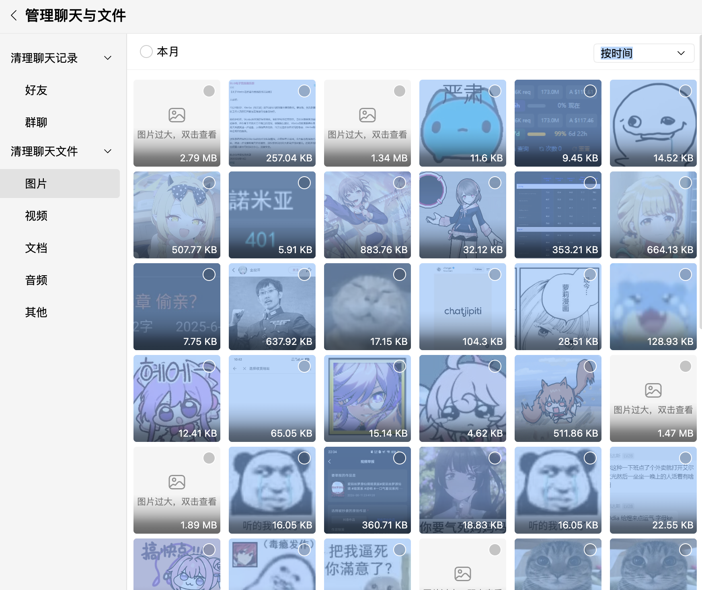
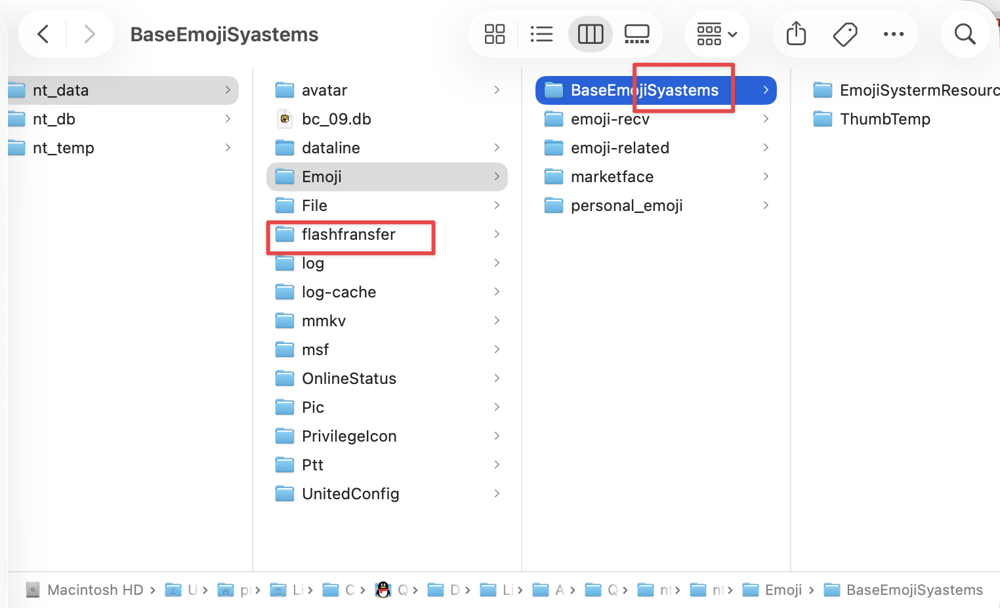
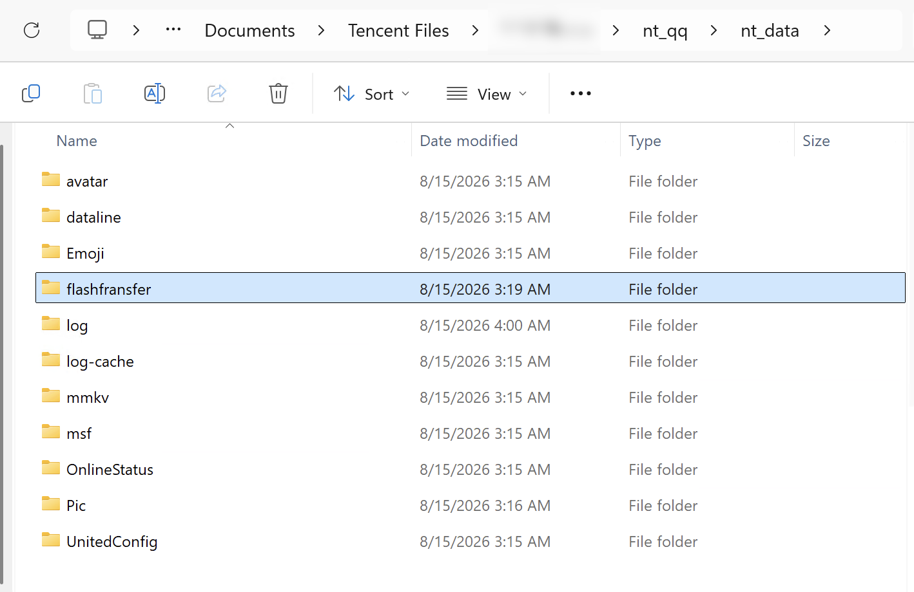
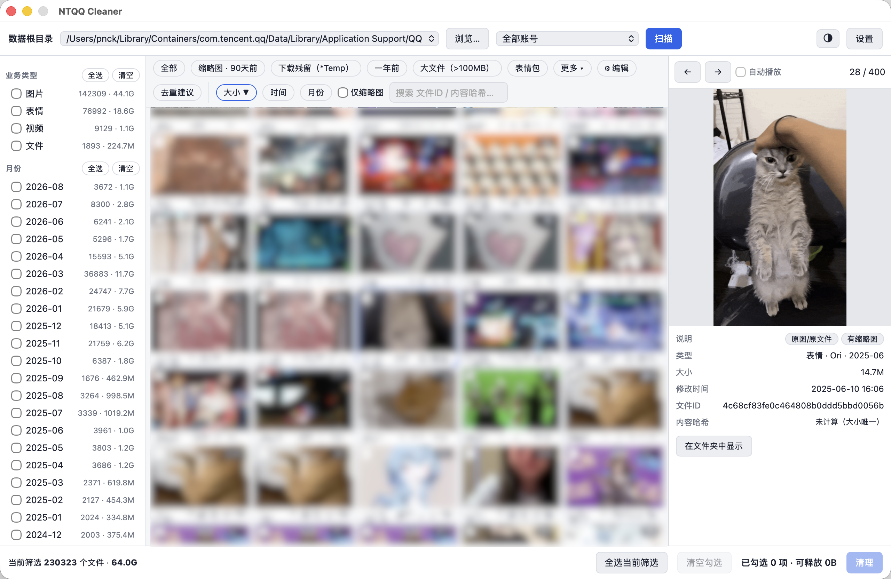

# NTQQ Cleaner — 极速 NTQQ 缓存清理工具

## 来自于以下自带空间管理工具的气笑时刻

- 扫描所有文件花了1分钟（…）
- 无法操作的好几G大的「其它数据」（？）
- 点了三层对话框才看到文件列表（？？）
- 想按时间清理N个月前群友拉的图屎结果发现按时间排序后只能一个月一个月选（😑）
- 按大小排序后发现「图片过大双击查看」（😡）
- 而且你还不知道这图片存在哪（😅）
- 而且你还不能批量选择，不能shift不能拖选（😅😅）
- 而且以防你不知道，就算删了原文件还有缩略图留着（😅😅😅）
- 而且以防你不知道，就算把群友拉的屎都删干净了，还有表情包占的空间在管理工具里是看不到的（😅😅😅😅）

## 当我按下 cmd+A 的时候我彻底破防了

## 我将用一整个开发周期参悟这两个单词的含义

## FEATURES

- 3秒完成23万个文件的扫描
- 15秒完成64G垃圾文件的去重分析
- 跨平台支持
- 解释器级别的自由灵活筛选机制
- 丝滑操控，极速预览所有媒体文件
- **代码由蓝色大肥鱼亲力亲为**

## TODO

- [ ] 引入消息记录解密按会话清理
- [ ] 支持legacy版本用户数据扫描

## 想掺和一脚
- 让肥鱼干活
  > 肥鱼，去读一下 [docs/CONTRIBUTING.md](docs/CONTRIBUTING.md) 告诉我这个项目怎么上手
- 加快逆向： [从 Google Drive 下载 idb](https://drive.google.com/drive/folders/1NdgDE-riH5v9FXtjnjIpJE6m0hpvnk-4?usp=sharing)
- 

  
Buy me a coffee in crypto ☕

   

  **SOL**: `2KHGRvqjmrjQ852BF9DeScNFtJtB8e9CgPKtgrTcshvh`

  ----

  **ETH**: `0x4C3826f5eAA9e03F474e6E304015ce8d0bc3C291`

  ----

  
